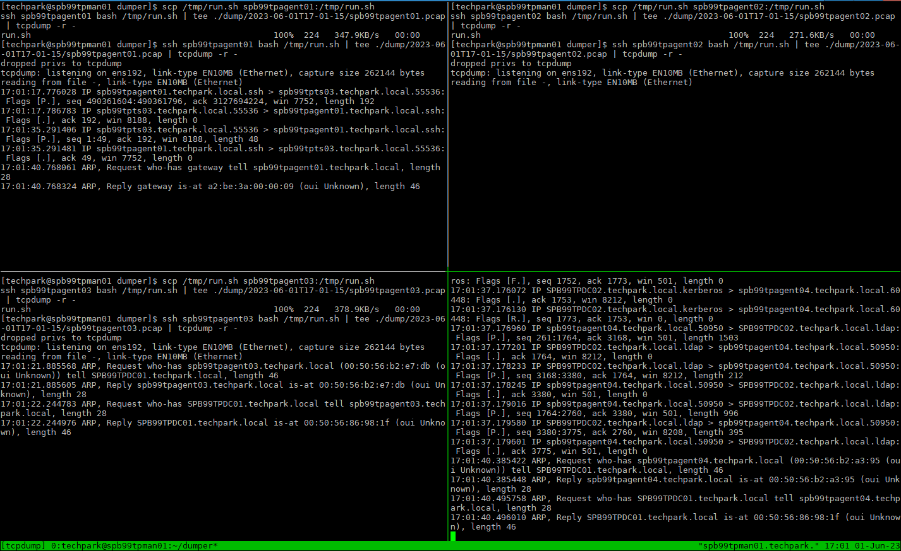

# Dumper
Скрипт запуска сбора трафика (tcpdump) на хостах в tmux

## Требования
* Удаленный хост linux с установленным `tcpdump, ip, sed`.
* Пользователь, из под которого запускается скрипт, должен подключаться по ключу через `ssh`.
* Пользователь, под которым происходит подключения к удаленному хосту, должен иметь право запуска `tcpdump`.
## Как работает
* Создается сессия `tmux` (по умолчанию `tcpdump`)
* Список хостов для подключения берется из файла (один хост на строку), указанного первым параметром (по умолчанию `list.txt`).
* Создаются окна максимумом с 4-мя панелями (общее кол-во панелей равно кол-ву хостов).
* В каждой панеле подключается к хосту через `ssh` и запускает `tcpdump`. Собирается весь трафик, кроме хоста,с котрого идет подключение.
* Трафик складывается в файл `hostname.pcap` в директорию указанную вторым параметром (по умолчанию `./dump`).
## Как работать в tmux
* В рамках одного окна весь ввод идет на все панели сразу, т.е. если нажать `ctrl+c`, то это прервет сбор трафика на всех панелях/хостах в текущем окне.
* Переключение между окнами `ctrl+b n`
* Переключение к конкретному окну `ctrl+b <номер_окна>`, окна нумеруются с 0
* Отключится от сессии `ctrl+b d`
* Вернуться в сессию `tmux a -t tcpdump`
* Оставновить сбор трафика `ctrl+c`
* Выход из всех панелей/хостов в текущем окне `ctrl+d`

## Запуск
```
$ cat list.txt
spb99tpagent01
spb99tpagent02
spb99tpagent03
spb99tpagent04
$ ./run.sh
Proccess spb99tpagent01 spb99tpagent02 spb99tpagent03 spb99tpagent04 in window 0
arranging in: tiled
run ssh spb99tpagent01 'tcpdump -n -i $(ip ro show match default | head -1 | sed -nr "s/.*dev ([^ ]+).*/\1/p") -w - -f "not host 10.50.56.230"' > ./dump/spb99tpagent01.pcap in pane 0.0
run ssh spb99tpagent02 'tcpdump -n -i $(ip ro show match default | head -1 | sed -nr "s/.*dev ([^ ]+).*/\1/p") -w - -f "not host 10.50.56.230"' > ./dump/spb99tpagent02.pcap in pane 0.1
run ssh spb99tpagent03 'tcpdump -n -i $(ip ro show match default | head -1 | sed -nr "s/.*dev ([^ ]+).*/\1/p") -w - -f "not host 10.50.56.230"' > ./dump/spb99tpagent03.pcap in pane 0.2
run ssh spb99tpagent04 'tcpdump -n -i $(ip ro show match default | head -1 | sed -nr "s/.*dev ([^ ]+).*/\1/p") -w - -f "not host 10.50.56.230"' > ./dump/spb99tpagent04.pcap in pane 0.3
set option: synchronize-panes -> on
[exited]
$ ls -lnh dump
total 68K
-rw-rw-r--. 1 1000 1000 24K Jun  1 11:09 spb99tpagent01.pcap
-rw-rw-r--. 1 1000 1000 16K Jun  1 11:09 spb99tpagent02.pcap
-rw-rw-r--. 1 1000 1000 12K Jun  1 11:09 spb99tpagent03.pcap
-rw-rw-r--. 1 1000 1000 16K Jun  1 11:07 spb99tpagent04.pcap

```
